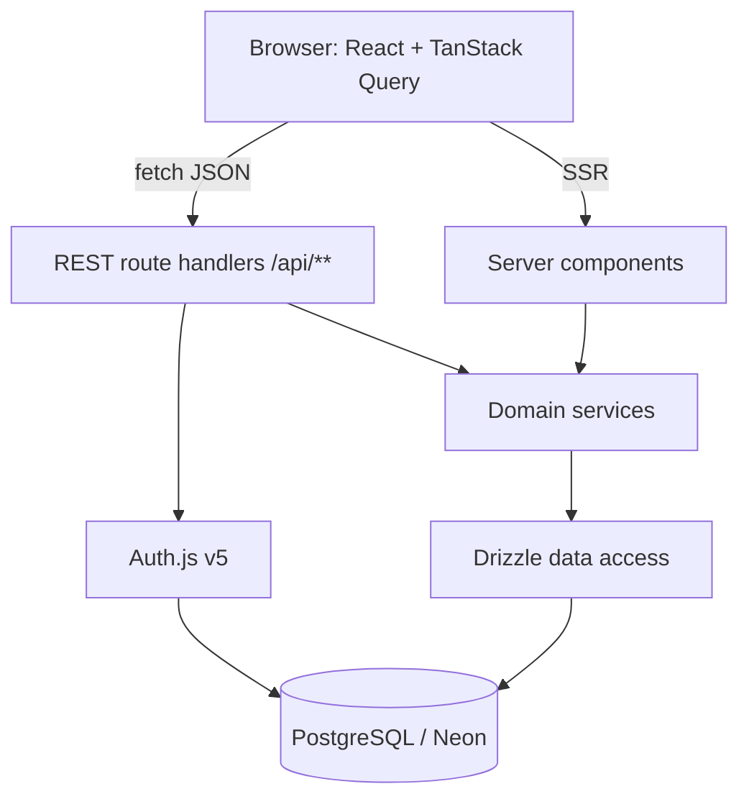
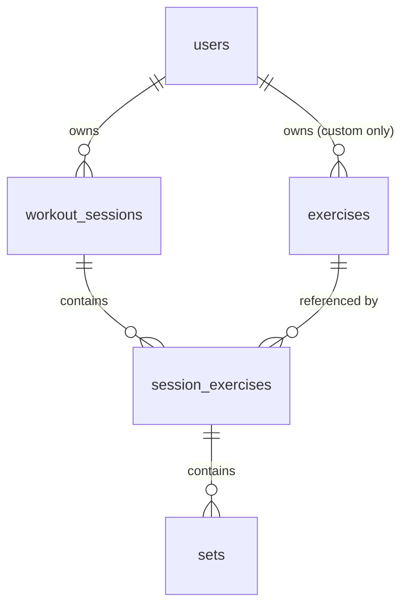

# Architecture

> Describes the system **as it is today**. Rewrite sections in place when things
> change — this file has no history. The decision records that explain *why*, and
> the per-path flow documents, are kept outside version control on the author's
> machine; this file is written to stand on its own without them.

_Last reviewed: 2026-08-18_

> Sections marked _(planned)_ are the agreed target shape and have no code
> behind them yet. Everything else describes what is in the repository.

## One-paragraph summary

The Exercise App is a web-based workout logger. A signed-in user records a
training session as an ordered list of exercises, each with sets of reps and
weight, then reads that history back as progress over time. It is a single
Next.js application in TypeScript: React components in the browser talk to REST
route handlers in the same deployment, which delegate to domain services, which
reach PostgreSQL through Drizzle. The one thing a newcomer must understand is
that **every row of training data is owned by a user, and the owning user id is
always taken from the server-side session — never from the request**. That rule,
not the framework choices, is what the layering exists to protect.

## What exists today

The authentication slice, the training **write** path and the **read** path are
built and running against the live database.

| Area | State |
| --- | --- |
| Schema | All eight tables migrated, plus `users.weight_unit` in `0001_tidy_makkari`. Originally (`users`, `accounts`, `sessions`, `verification_tokens`, `exercises`, `workout_sessions`, `session_exercises`, `sets`). `0000_rapid_the_fury`. |
| Exercise catalog | Seeded, 60 global rows (`owner_id IS NULL`). `npm run db:seed` is idempotent. Custom exercises can be created. |
| Auth | Email/password sign-in, registration, sign-out. Auth.js v5, `jwt` session strategy. `currentUserId()` in `src/server/auth.ts` is how server code asks who is acting. |
| Route handlers | Registration, the Auth.js catch-all, the exercise catalog, the workout-session → exercise-entry → set write path, and the progress reads. See the table below. |
| Pages | `/` (session-aware landing), `/sign-in`, `/sign-up`, `/log`, `/history`, `/history/[id]`, `/progress`. |
| Domain services | `users`, `exercises`, `training`, `progress` in `src/server/services/`. |
| Data access | `queries/users.ts`, `queries/exercises.ts`, `queries/training.ts`, `queries/progress.ts`. |
| Error contract | `src/app/api/_lib/respond.ts` maps every `DomainErrorCode` to a status. |
| Tests | Vitest against a local Postgres in Docker: 78 tests, plus 5 Playwright journeys in `e2e/` against a real server on the same database. Domain services in `src/server/services/*.test.ts`, the HTTP contract in `src/app/api/routes.test.ts` with `currentUserId` mocked. Components are not covered. |

### The API surface

| Method and path | Does |
| --- | --- |
| `POST /api/users` | Register. The only route reachable without a session. |
| `GET`/`PATCH /api/users/me` | The signed-in user's own settings — currently the display unit. No route takes a user id in its path. |
| `DELETE /api/users/me` | Delete the account and everything in it. Irreversible, one transaction. |
| `/api/auth/[...nextauth]` | Auth.js: sign in, sign out, session. |
| `GET /api/exercises` | The catalog this user may see: global plus their own. `?search=` filters by name. |
| `POST /api/exercises` | Create a custom exercise, private to the caller. |
| `GET /api/workout-sessions` | This user's sessions, newest first, with entry and set counts. `?active=true` returns the one in progress **with its exercise entries and sets**, or `null` — the logging screen's whole payload. |
| `POST /api/workout-sessions` | Start a session. 409 if one is already in progress. |
| `GET /api/workout-sessions/[id]` | One session with its exercise entries and their sets. |
| `PATCH /api/workout-sessions/[id]` | Edit notes and/or `endedAt`. `endedAt: null` reopens it. |
| `DELETE /api/workout-sessions/[id]` | Delete it, cascading to entries and sets. |
| `POST /api/workout-sessions/[id]/exercises` | Add an exercise entry to the end of the session. |
| `PATCH /api/workout-sessions/[id]/exercises` | Rewrite the running order. Takes every entry id exactly once; a partial list is a 422. |
| `DELETE /api/exercise-entries/[id]` | Remove an entry and its sets. |
| `POST /api/exercise-entries/[id]/sets` | Log a set. |
| `PATCH /api/sets/[id]` | Correct a logged set's reps, weight or warm-up flag. `position` is not editable. |
| `DELETE /api/sets/[id]` | Remove a set. |
| `GET /api/exercises/[id]/last-performance` | The previous time this exercise was done. `?exclude=` leaves a session out — the logging screen excludes the one in progress. |
| `GET /api/progress/personal-records` | The heaviest working set per exercise. |
| `GET /api/progress/volume` | Working-set volume by muscle group by week. `?weeks=` defaults to 8, clamped 1–52 in the service. |

Every one of them takes the acting user from the auth session. A path id that
belongs to another user is answered `404`, never `403`: the difference would
itself be a way to probe for rows.

The next slice is whatever the log turns out to need in use — editing a logged
set, reordering exercises, and a display unit in pounds are the three that are
already visible.

## Components

| Component | Lives in | Responsibility | Talks to |
| --- | --- | --- | --- |
| Web UI | `src/app/**`, `src/components/**` | Render pages; resolve the acting account through `src/app/_lib/require-account.ts`; capture set-by-set input fast enough to use between sets | REST API through `src/lib/api.ts` and TanStack Query, domain services (server components only) |
| API client | `src/lib/api.ts`, `src/lib/queries.ts`, `src/app/providers.tsx` | The browser's side of the REST contract: one `apiFetch` throwing `ApiError`, and the TanStack Query cache the logging screen runs on (ADR 0014) | REST API |
| REST API | `src/app/api/**` | HTTP boundary: authenticate, validate with Zod, map results to status codes | Domain services |
| Domain services | `src/server/services/**` | Business rules: session lifecycle, ownership checks, personal records, volume aggregation | Data access |
| Progress reads | `src/server/db/queries/progress.ts`, `services/progress.ts` | Aggregates over logged training: records, last performance, weekly volume | PostgreSQL |
| Data access | `src/server/db/**` | Drizzle schema, typed queries, migrations, unit conversion at the boundary | PostgreSQL |
| Auth | `src/server/auth.ts`, `src/app/api/auth/**` | Sign-in, auth sessions, the `users` table | PostgreSQL |
| Tests | `src/**/*.test.ts`, `src/test/**` | Service and handler suite: migrates and seeds a disposable local database, empties the log between cases | Local PostgreSQL in Docker |
| End-to-end | `e2e/**`, `playwright.config.ts` | A real browser against `next dev` on port 3100: sign-up, logging, unit switching, cross-user isolation. The only suite that runs Auth.js for real | Next server → local PostgreSQL |

The App Router lives under `src/app/**`, not `app/**` — the app was scaffolded
with `--src-dir`.

The wire types the API client works with are declared in
`src/lib/types/training.ts` rather than re-exported from the service layer: a
client component may not import from `src/server/**`, and the shapes differ
anyway, because a timestamp is a `Date` in a service and an ISO string once it
has been through JSON.

## System shape

### Database access

`src/server/db/index.ts` is the only place a connection is opened. It uses
`pg` (node-postgres) through `drizzle-orm/node-postgres` against the **pooled**
Neon string — not `@neondatabase/serverless`, because the same handle has to
serve server components, route handlers and the drizzle-kit seed script. The
pool is capped at 10, handed to `attachDatabasePool` from `@vercel/functions`
so Fluid compute drains it before suspend, and cached on `globalThis` in
development so Next's module re-evaluation does not leak a pool per edit.

drizzle-kit is the exception: `drizzle.config.ts` reads `.env.local` itself and
connects with the **direct** URL, because migrations need a real session.

## Boundaries and rules

These are the lines that are expensive to uncross:

- **The session is the only source of identity.** A handler or service takes the
  acting user id from the Auth.js session. Never from a body field, query
  parameter or path segment.
- **Route handlers contain no SQL and no business rules.** They authenticate,
  validate, delegate, and translate the result into a status code. Four steps,
  in that order.
- **Domain services know nothing about HTTP.** No `Request`, no `Response`, no
  status codes. They throw typed domain errors; the handler maps them.
- **No Server Actions.** REST route handlers are the only mutation surface.
- **Client components never import the database layer.** Anything under
  `src/server/**` is server-only and must stay unreachable from a `"use client"`
  file.
- **Every request body is parsed by a Zod schema at the handler edge.** Handlers
  work with the parsed output, never with raw JSON.
- **Weight is kilograms in the database, always.** `users.weight_unit` is a
  *display* preference. Conversion lives in `src/lib/weight.ts` and is called
  from components only — never in a service, never in a query, and never on the
  way into the request schema's `weight` field, which is already kilograms.
- **Order is assigned by the database, never sent by the client.** A new
  exercise entry or set goes on the end: `position` is `max(position) + 1`,
  computed inside the insert statement in `src/server/db/queries/training.ts`.
  Reordering is the one exception and still sends no positions: the client sends
  the full list of entry ids, and the server derives 1..n from it inside a
  transaction (ADR 0010).
- **One workout session in progress at a time.** `ended_at IS NULL` is what "in
  progress" means, and a second attempt to start one is a `409`. Without it
  "the current session" is ambiguous for every screen that asks for it.
- **One UI kit.** shadcn/ui components are copied into `src/components/ui/` and
  edited in place. A second component library does not get added to solve a
  one-component problem.

## Data model

Ownership chain — everything hangs off `users`:

- **users** — Auth.js owns this table, plus `accounts`, `sessions` and
  `verification_tokens`. It lives in our database, so every foreign key is real.
- **exercises** — the movement catalog. `owner_id` is nullable: NULL is a seeded
  global exercise visible to everyone, a value is one user's private custom
  exercise. Every catalog read filters `owner_id IS NULL OR owner_id = <session user>`.
- **workout_sessions** — one training session for one user: start time, end
  time, notes.
- **session_exercises** — an exercise performed within a session, with
  `position` for ordering and its own notes. This row exists so ordering,
  per-exercise notes and supersets have somewhere to live.
- **sets** — the leaf: `position`, `reps`, `weight` (numeric, kilograms),
  `is_warmup`.

Reads that shape the schema: last performance of a given exercise, personal
record per exercise, and weekly volume by muscle group.

## External dependencies

| Service | Used for | Failure behaviour |
| --- | --- | --- |
| Neon (PostgreSQL) | All persistent data | Total outage: the app cannot function. Free-tier branches suspend when idle, so the first query after a pause is slow, not failed. |
| Vercel | Hosting, TLS, preview deploys | Outage takes the app down; no fallback host is configured. |
| Auth.js OAuth providers _(planned, optional)_ | Third-party sign-in | Provider outage blocks that sign-in method only; credentials sign-in stays available. |

## Environments

| | Local | Preview | Production |
| --- | --- | --- | --- |
| App | `next dev` | Vercel preview per branch | Vercel production |
| Database | `next dev` uses the same Neon database as everything else. Tests use a local `postgres:17-alpine` from `docker-compose.yml` on port 5433 (ADR 0009) | Neon branch per preview _(planned)_ | Neon primary |

Configuration comes from environment variables (`.env.local` locally, project
settings on Vercel). Two database URLs are always set and never derived from
each other: a **pooled** URL for the running app, and a **direct** URL for
drizzle-kit migrations.

## Known rough edges

- **`next dev` writes files into the tree.** It regenerates `AGENTS.md` and the
  route types under `.next/types`. On a fresh clone `npx tsc --noEmit` fails
  with `Cannot find name 'LayoutProps'` until `npx next typegen` (or a dev
  server, or a build) has run once.
- **Development shares the production database.** `next dev` still points at the
  Neon primary, so a careless `npm run db:push` or a destructive query in
  Drizzle Studio hits real data. The Docker database is for tests only.
  Per-developer Neon branches are the intended fix and are not set up.
- **Aggregates cut weeks in the database's timezone**, which on Neon is UTC.
  A user in Auckland or Los Angeles sees a week boundary that is not their
  local Monday, and nothing takes a timezone from the user.
- **`date_trunc` and `sum(numeric)` come back as strings.** Both are cast or
  converted in `queries/progress.ts` — `sum(...)::float8`, and the week as epoch
  milliseconds turned into a `Date`. A new aggregate that skips the cast returns
  a string that TypeScript will happily call a number.
- **Component coverage is only what the three end-to-end journeys walk
  through.** There is no component-level test runner — no jsdom, no Testing
  Library — so a component off those paths is verified by hand.
- **Handler tests mock the session.** `currentUserId` is replaced wholesale in
  `src/app/api/routes.test.ts`; the end-to-end suite is what actually exercises
  Auth.js, and it does so in three paths only.
- **The end-to-end suite needs a matching browser build.** `npx playwright
  install chromium` after a Playwright upgrade, or every spec fails on launch.
- **Switching the display unit is fire-and-forget.** The select PATCHes and does
  not block; navigating in the same instant can abandon the write, and the
  control will have already moved. The window is small and real.
- **Tests run on Postgres 17 in Docker, not on Neon.** The pooler, scale-to-zero
  behaviour and any storage-layer difference are untested; a Neon-only bug still
  reaches production (ADR 0009).
- **One unexplained test failure has been seen once.** A full run failed a
  single test immediately after the `pretest` script was added and has not
  reproduced in eleven runs since, including on a freshly created database. The
  output was not captured. The concurrent-registration test is the only
  non-deterministic one and is the first place to look if it recurs.
- **Account deletion cannot be undone.** It is a hard delete in one transaction
  (ADR 0013), and Neon's untested backups are the only route back.
- **A JWT can name an account that no longer exists.** Sessions are not
  revocable (ADR 0007), so after a deletion the token stays valid until it
  expires. `requireAccount()` in `src/app/_lib/` and the landing page treat that
  as signed out; anything new that reads the session must do the same, or it
  will 500 in exactly that state.
- **An optimistic write can be lost by navigating away.** A logged or edited set
  appears before the server has it (ADR 0014). The row shows "saving…" with its
  controls disabled until the write lands, but nothing stops a user leaving the
  page in that window, and they will have seen the set appear. A durable fix is
  a persisted mutation queue.
- **The first paint and the cache are two sources of truth.** `/log` renders
  from `getActiveWorkoutSessionDetail` and the cache refetches
  `GET /api/workout-sessions?active=true`. They agree today because they are the
  same call; nothing enforces that they keep agreeing.
- **`position` is left with gaps.** Deleting a set or an exercise entry does not
  renumber what follows, so a UI that prints the number shows 1, 2, 4. A reorder
  closes the gaps for exercise entries as a side effect; sets have no reorder,
  so their gaps stay.
- **Editing a set in pounds can shift it by 10 g.** Display rounds to one
  decimal place, so 62.5 kg shows as 137.8 lb, and saving that back stores
  62.51 kg. Re-saving an untouched set is therefore not always a no-op for a
  user in pounds. Storing the entered unit alongside the value would fix it.
- **A stale client can silently undo a reorder.** The order is sent whole and
  the last write wins; nothing versions a session (ADR 0010).
- **Two simultaneous writes to the same entry can collide.** `position` is
  `max(position) + 1` inside the insert, which is one statement but not a lock:
  two requests racing for the same slot means one hits the unique index and gets
  a 500. It takes two devices logging the same exercise at the same instant.
- **Auth.js `authorize` collapses every failure into `null`.** Deliberate, so
  accounts cannot be enumerated, but it also means a genuine database outage
  during sign-in is indistinguishable from a wrong password.
- **Restore has never been tested.** Neon's automated backups are the whole
  recovery story and remain unverified. Test a restore before the log holds
  history worth losing.
- **`numeric` arrives as a string.** The Postgres driver returns `numeric`
  columns as strings. Weight must be converted once, in the data-access layer,
  or float arithmetic will drift into the UI unnoticed.
- **The nullable `owner_id` catalog filter is easy to forget.** A single query
  missing it leaks other users' custom exercises. It belongs in a shared query
  helper, not repeated by hand.
- **Serverless connection limits.** Vercel functions plus a non-pooled
  connection string is a failure that only appears under load.
- **shadcn components do not upgrade.** They are copies. Upstream fixes must be
  pulled in deliberately.
- **Auth.js v5 documentation lags its releases.** Expect config that looks right
  and is not.
