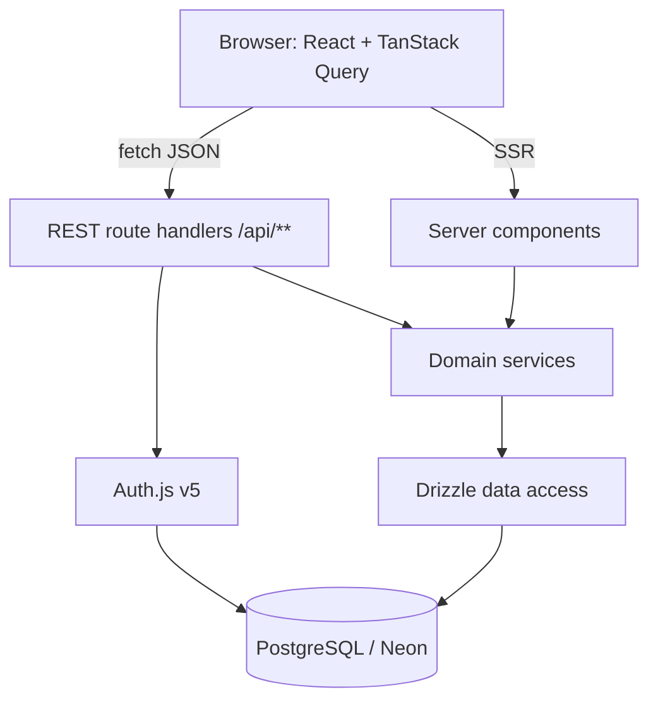
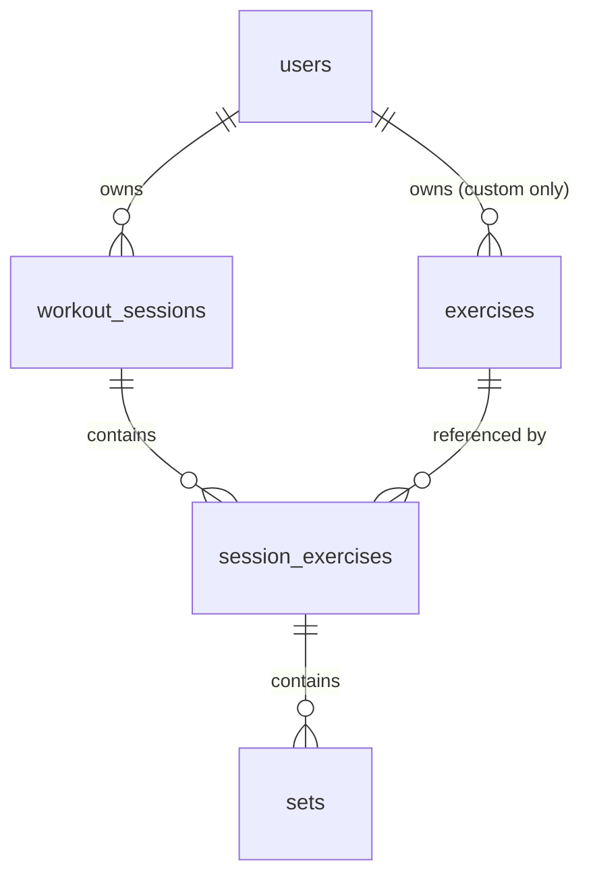

# Architecture

> Describes the system **as it is today**. Rewrite sections in place when things
> change — this file has no history. The decision records that explain *why*, and
> the per-path flow documents, are kept outside version control on the author's
> machine; this file is written to stand on its own without them.

_Last reviewed: 2026-08-18_

> Sections marked _(planned)_ are the agreed target shape and have no code
> behind them yet. Everything else describes what is in the repository.

## One-paragraph summary

The Exercise App is a web-based workout logger. A signed-in user records a
training session as an ordered list of exercises, each with sets of reps and
weight, then reads that history back as progress over time. It is a single
Next.js application in TypeScript: React components in the browser talk to REST
route handlers in the same deployment, which delegate to domain services, which
reach PostgreSQL through Drizzle. The one thing a newcomer must understand is
that **every row of training data is owned by a user, and the owning user id is
always taken from the server-side session — never from the request**. That rule,
not the framework choices, is what the layering exists to protect.

## What exists today

The authentication slice, the training **write** path and the **read** path are
built and running against the live database.

| Area | State |
| --- | --- |
| Schema | Ten tables migrated. The original eight in `0000_rapid_the_fury` (`users`, `accounts`, `sessions`, `verification_tokens`, `exercises`, `workout_sessions`, `session_exercises`, `sets`), then `users.weight_unit` in `0001_tidy_makkari`, `sign_in_attempts` in `0002_grey_gargoyle`, `users.theme` in `0003_complex_tomorrow_man`, and `routines` + `routine_exercises` in `0004_serious_sumo`. |
| Exercise catalog | Seeded, 71 global rows (`owner_id IS NULL`). `npm run db:seed` is idempotent. Custom exercises can be created. |
| Auth | Email/password sign-in, registration, sign-out, account deletion. Auth.js v5, `jwt` session strategy. Sign-in is throttled to ten failures per email per fifteen minutes (ADR 0015). `currentUserId()` in `src/server/auth.ts` is how server code asks who is acting. |
| Route handlers | Registration, the Auth.js catch-all, the exercise catalog, the workout-session → exercise-entry → set write path, and the progress reads. See the table below. |
| Pages | `/` (session-aware landing), `/sign-in`, `/sign-up`, `/log`, `/log/[entryId]`, `/routines`, `/routines/start`, `/routines/[id]`, `/history`, `/history/[id]`, `/progress`, `/settings`. |
| Exercise marks | `src/components/ui/exercise-icon.tsx` draws a line mark per movement, matched on the catalog name; all 71 global exercises have one, and anything unmatched (a custom exercise) falls back to the mascot. Used by the logging card and the stepper screen. |
| Domain services | `users`, `exercises`, `training`, `routines`, `progress` in `src/server/services/`. |
| Theming | Six colour themes (ADR 0017), stored on `users.theme` and applied by the root layout as `data-theme` on `<html>`. Every screen already reads role tokens, so a theme is a block of token values in `globals.css` and nothing else. Two are dark. |
| Data access | `queries/users.ts`, `queries/exercises.ts`, `queries/training.ts`, `queries/routines.ts`, `queries/progress.ts`, and `queries/positions.ts` for the one shared `max(position) + 1` expression. |
| Error contract | `src/app/api/_lib/respond.ts` maps every `DomainErrorCode` to a status. |
| Routines | Reusable, named lists of exercises (`routines`, `routine_exercises`). Created, edited, reordered and deleted on `/routines`. A **Start routine** link on the home screen and `/log` opens `/routines/start`, a screen of one card per routine; tapping one **copies** its exercises into a new workout session, and nothing links them afterwards. |
| Tests | Vitest against a local Postgres in Docker: 196 tests, plus 8 Playwright journeys in `e2e/` against a real server on the same database. Domain services in `src/server/services/*.test.ts`, the HTTP contract in `src/app/api/routes.test.ts` with `currentUserId` mocked. Components are not covered. |

### The API surface

| Method and path | Does |
| --- | --- |
| `POST /api/users` | Register. The only route reachable without a session. |
| `GET`/`PATCH /api/users/me` | The signed-in user's own settings: display unit and theme. `PATCH` takes either or both and answers with the whole set; an empty body is a `422`. No route takes a user id in its path. |
| `DELETE /api/users/me` | Delete the account and everything in it. Irreversible, one transaction. |
| `/api/auth/[...nextauth]` | Auth.js: sign in, sign out, session. |
| `GET /api/exercises` | The catalog this user may see: global plus their own. `?search=` filters by name. |
| `POST /api/exercises` | Create a custom exercise, private to the caller. |
| `GET /api/workout-sessions` | This user's sessions, newest first, with entry and set counts. `?active=true` returns the one in progress **with its exercise entries and sets**, or `null` — the logging screen's whole payload. |
| `POST /api/workout-sessions` | Start a session, empty or pre-filled from a routine via `routineId`. 409 if one is already in progress. |
| `GET /api/workout-sessions/[id]` | One session with its exercise entries and their sets. |
| `PATCH /api/workout-sessions/[id]` | Edit notes and/or `endedAt`. `endedAt: null` reopens it. |
| `DELETE /api/workout-sessions/[id]` | Delete it, cascading to entries and sets. |
| `POST /api/workout-sessions/[id]/exercises` | Add an exercise entry to the end of the session. |
| `PATCH /api/workout-sessions/[id]/exercises` | Rewrite the running order. Takes every entry id exactly once; a partial list is a 422. |
| `DELETE /api/exercise-entries/[id]` | Remove an entry and its sets. |
| `GET /api/routines` | This user's routines, alphabetically, with a count of what is in each. |
| `POST /api/routines` | Create a routine. Names are unique per user; a repeat is a 409. |
| `GET /api/routines/[id]` | One routine with its exercises, in order. |
| `PATCH /api/routines/[id]` | Rename it and/or edit its notes. |
| `DELETE /api/routines/[id]` | Delete it and its exercises. Workout sessions started from it are untouched. |
| `POST /api/routines/[id]/exercises` | Append an exercise to the routine. |
| `PATCH /api/routines/[id]/exercises` | Rewrite the routine's order. Takes every id exactly once; a partial list is a 422. |
| `DELETE /api/routine-exercises/[id]` | Remove one exercise from a routine. |
| `POST /api/exercise-entries/[id]/sets` | Log a set. |
| `PATCH /api/sets/[id]` | Correct a logged set's reps, weight or warm-up flag. `position` is not editable. |
| `DELETE /api/sets/[id]` | Remove a set. |
| `GET /api/exercises/[id]/last-performance` | The previous time this exercise was done. `?exclude=` leaves a session out — the logging screen excludes the one in progress. |
| `GET /api/progress/personal-records` | The heaviest working set per exercise. |
| `GET /api/progress/volume` | Working-set volume by muscle group by week. `?weeks=` defaults to 8, clamped 1–52 in the service. |

The `/progress` screen reads more than this table exposes: which lifts have been
trained lately (`getLoggedExercises`), one lift's heaviest set per day
(`getStrengthProgress`), one lift's volume per bucket (`getExerciseVolume`) and
the top set of the workout it was last done in (`getLastTopSet`)
are called straight from the server component, and have no endpoint. That is allowed — a server component may call a domain
service — but it means the REST surface is no longer a mirror of the screens.

Every one of them takes the acting user from the auth session. A path id that
belongs to another user is answered `404`, never `403`: the difference would
itself be a way to probe for rows.

The next slice is whatever the log turns out to need in use. The exercise
catalog has no screen of its own — `/browse` was a placeholder and was replaced
by `/routines` in the tab bar, so the catalog is reachable only through the two
pickers that add an exercise to something.

## Components

| Component | Lives in | Responsibility | Talks to |
| --- | --- | --- | --- |
| Web UI | `src/app/**`, `src/components/**` | Render pages; resolve the acting account through `src/app/_lib/require-account.ts`; capture set-by-set input fast enough to use between sets | REST API through `src/lib/api.ts` and TanStack Query, domain services (server components only) |
| API client | `src/lib/api.ts`, `src/lib/queries.ts`, `src/app/providers.tsx` | The browser's side of the REST contract: one `apiFetch` throwing `ApiError`, and the TanStack Query cache the logging screen runs on (ADR 0014) | REST API |
| REST API | `src/app/api/**` | HTTP boundary: authenticate, validate with Zod, map results to status codes | Domain services |
| Domain services | `src/server/services/**` | Business rules: session lifecycle, ownership checks, personal records, top set per day, volume aggregation | Data access |
| Progress reads | `src/server/db/queries/progress.ts`, `services/progress.ts` | Aggregates over logged training: records, last performance, volume by bucket, one lift's top set over time, and the top set of its last workout | PostgreSQL |
| Data access | `src/server/db/**` | Drizzle schema, typed queries, migrations, unit conversion at the boundary | PostgreSQL |
| Auth | `src/server/auth.ts`, `src/app/api/auth/**` | Sign-in, auth sessions, the `users` table | PostgreSQL |
| Tests | `src/**/*.test.ts`, `src/test/**` | Service and handler suite: migrates and seeds a disposable local database, empties the log between cases | Local PostgreSQL in Docker |
| End-to-end | `e2e/**`, `playwright.config.ts` | A real browser against `next dev` on port 3100: sign-up, logging, unit switching, cross-user isolation. The only suite that runs Auth.js for real | Next server → local PostgreSQL |

The App Router lives under `src/app/**`, not `app/**` — the app was scaffolded
with `--src-dir`.

### Navigation

The five signed-in destinations sit in a `(tabs)` route group. The group is a
route group, so it changes no URL — `/log` is still `/log` — and it exists for
one reason: `src/app/(tabs)/layout.tsx` renders the tab bar as a *layout*, which
means React keeps it mounted across a navigation between tabs and re-renders
only the page below it. The bar used to be rendered by `Screen`, so it was part
of every page's own payload and could not paint until that page's data had
resolved.

`Screen` no longer renders the bar; it is the `<main>` column and nothing else.

**There is deliberately no `loading.tsx` here, and adding one makes the app
slower.** It was tried and measured. A loading boundary does buy an earlier
first frame — a skeleton at ~60 ms instead of content at ~120 ms — but the real
content then arrives at ~850 ms rather than ~120 ms, uniformly, on every route
in the group and regardless of how many queries that route runs. It buys a
placeholder 60 ms earlier and charges 580 ms for it. The measurement is in
`Known rough edges`; re-run it before reaching for a skeleton again.

Home (`/`) is deliberately outside the group. It renders a signed-out landing as
well as the signed-in screen and a layout cannot tell which one it got, so it
keeps its own `<TabBar />`. Home↔tab therefore remounts the bar; tab↔tab does
not.

`experimental.staleTimes.dynamic` in `next.config.ts` lets a visited tab be
reused from the client router cache for thirty seconds. See `Known rough edges`
for what that costs.

One preferences row, one query: the root layout needs it for the palette and
every page needs it for the display unit, so both go through
`currentPreferences` in `src/app/_lib/preferences.ts`, which is React `cache`
around the service call. Reading `getPreferences` directly from a page puts the
second query back.

The wire types the API client works with are declared in
`src/lib/types/training.ts` rather than re-exported from the service layer: a
client component may not import from `src/server/**`, and the shapes differ
anyway, because a timestamp is a `Date` in a service and an ISO string once it
has been through JSON.

## System shape

### Database access

`src/server/db/index.ts` is the only place a connection is opened. It uses
`pg` (node-postgres) through `drizzle-orm/node-postgres` against the **pooled**
Neon string — not `@neondatabase/serverless`, because the same handle has to
serve server components, route handlers and the drizzle-kit seed script. The
pool is capped at 10, handed to `attachDatabasePool` from `@vercel/functions`
so Fluid compute drains it before suspend, and cached on `globalThis` in
development so Next's module re-evaluation does not leak a pool per edit.

drizzle-kit is the exception: `drizzle.config.ts` reads `.env.local` itself and
connects with the **direct** URL, because migrations need a real session.

## Boundaries and rules

These are the lines that are expensive to uncross:

- **The session is the only source of identity.** A handler or service takes the
  acting user id from the Auth.js session. Never from a body field, query
  parameter or path segment.
- **Route handlers contain no SQL and no business rules.** They authenticate,
  validate, delegate, and translate the result into a status code. Four steps,
  in that order.
- **Domain services know nothing about HTTP.** No `Request`, no `Response`, no
  status codes. They throw typed domain errors; the handler maps them.
- **No Server Actions.** REST route handlers are the only mutation surface.
- **Client components never import the database layer.** Anything under
  `src/server/**` is server-only and must stay unreachable from a `"use client"`
  file.
- **Every request body is parsed by a Zod schema at the handler edge.** Handlers
  work with the parsed output, never with raw JSON.
- **Colour is a role token, never a hex in a component.** Every surface reads
  `--background`, `--card`, `--brand` and their siblings; a theme redefines
  those and no selector below `:root` may name a component. A component that
  hard-codes a colour is invisible to five of the six themes.
- **Weight is kilograms in the database, always.** `users.weight_unit` is a
  *display* preference. Conversion lives in `src/lib/weight.ts` and is called
  from components only — never in a service, never in a query, and never on the
  way into the request schema's `weight` field, which is already kilograms.
- **Order is assigned by the database, never sent by the client.** A new
  exercise entry or set goes on the end: `position` is `max(position) + 1`,
  computed inside the insert statement in `src/server/db/queries/training.ts`.
  Reordering is the one exception and still sends no positions: the client sends
  the full list of entry ids, and the server derives 1..n from it inside a
  transaction (ADR 0010).
- **One workout session in progress at a time.** `ended_at IS NULL` is what "in
  progress" means, and a second attempt to start one is a `409`. Without it
  "the current session" is ambiguous for every screen that asks for it.
- **One UI kit.** shadcn/ui components are copied into `src/components/ui/` and
  edited in place. A second component library does not get added to solve a
  one-component problem.

## Data model

Ownership chain — everything hangs off `users`:

- **users** — Auth.js owns this table, plus `accounts`, `sessions` and
  `verification_tokens`. It lives in our database, so every foreign key is real.
- **exercises** — the movement catalog. `owner_id` is nullable: NULL is a seeded
  global exercise visible to everyone, a value is one user's private custom
  exercise. Every catalog read filters `owner_id IS NULL OR owner_id = <session user>`.
- **workout_sessions** — one training session for one user: start time, end
  time, notes.
- **session_exercises** — an exercise performed within a session, with
  `position` for ordering and its own notes. This row exists so ordering,
  per-exercise notes and supersets have somewhere to live.
- **sets** — the leaf: `position`, `reps`, `weight` (numeric, kilograms),
  `is_warmup`.

Reads that shape the schema: last performance of a given exercise, personal
record per exercise, and weekly volume by muscle group.

## External dependencies

| Service | Used for | Failure behaviour |
| --- | --- | --- |
| Neon (PostgreSQL) | All persistent data | Total outage: the app cannot function. Free-tier branches suspend when idle, so the first query after a pause is slow, not failed. |
| Vercel | Hosting, TLS, preview deploys | Outage takes the app down; no fallback host is configured. |
| Auth.js OAuth providers _(planned, optional)_ | Third-party sign-in | Provider outage blocks that sign-in method only; credentials sign-in stays available. |

## Environments

| | Local | Preview | Production |
| --- | --- | --- | --- |
| App | `next dev` | Vercel preview per branch | Vercel production |
| Database | `next dev` uses the same Neon database as everything else. Tests use a local `postgres:17-alpine` from `docker-compose.yml` on port 5433 (ADR 0009) | Neon branch per preview _(planned)_ | Neon primary |

Configuration comes from environment variables (`.env.local` locally, project
settings on Vercel). Two database URLs are always set and never derived from
each other: a **pooled** URL for the running app, and a **direct** URL for
drizzle-kit migrations.

`vercel.json` pins functions to `pdx1`, which is `aws-us-west-2` — the region
the Neon project is in. Without it Vercel defaults to `iad1`, on the other side
of the country, and every query in a render pays that crossing twice. The two
values have to move together: putting the database in a new region and leaving
this one alone is a slow app with nothing obviously wrong with it.

## Known rough edges

- **A tab can be thirty seconds stale.** `experimental.staleTimes.dynamic = 30`
  lets the client router reuse a tab you were just on without a server round
  trip. Training mutations go through TanStack Query, which invalidates *its*
  cache and knows nothing about the router's — so anything whose effect shows on
  another tab has to call `router.refresh()` by hand. Four do: the two start
  buttons (`start-workout-button.tsx`, `routine-start-list.tsx`),
  `crossTabMutation` in `workout-logger.tsx`, which covers start and finish, and
  both mutations in `routine-list.tsx` — whether any routine exists is what
  decides if Home and `/log` offer a way to start one. A new mutation that
  changes what another tab shows and forgets the refresh fails silently, and
  only for half a minute, which is the worst way to fail. `e2e/routines.spec.ts`
  caught exactly that and is the guard against it.
- **A `loading.tsx` in `(tabs)` costs more than it buys, and the win here is not
  where it looks.** Measured on a production build against a Postgres delayed to
  Neon's real round trip from this machine (28 ms), fresh account, five tabs:

  | | first visit (paint / content) | repeat visit | server round trips |
  | --- | --- | --- | --- |
  | Before any of this | 120 / 123 ms | 116 / 119 ms | 1 per switch |
  | `(tabs)` layout + `staleTimes` | 110 / 113 ms | **62 / 65 ms** | **0** |
  | …plus a `loading.tsx` | 61 / **694** ms | 64 / 68 ms | 0 |

  The whole improvement is the layout and the client router cache. The skeleton
  contributes nothing to the repeat number and delays real content by ~580 ms on
  the first visit, uniformly, on routes whose query counts differ by a factor of
  five — so it is not query work. It also cost the 404 status on the detail
  routes, because a streamed response commits its status with the shell before
  the page reaches `notFound()`. Removing it fixed both.
- **The numbers above are from a local server.** They isolate the framework, not
  the deployment: `vercel.json` pinning `pdx1` and the query work in
  `services/progress.ts` and `queries/training.ts` matter in production, where a
  render crosses the network several times, and are invisible in a benchmark
  like this one. A dev server is slower again — first visit to a route includes
  compiling it.
- **The tab bar is rendered in two places.** `src/app/(tabs)/layout.tsx` for the
  five tabs, and `src/app/page.tsx` for Home, which cannot join the group
  because it also renders the signed-out landing. Adding a sixth tab means
  editing `TABS` in `tab-bar.tsx` and nothing else, but *moving* Home into the
  group means first giving the landing a route of its own.
- **`next dev` writes files into the tree.** It regenerates `AGENTS.md` and the
  route types under `.next/types`. On a fresh clone `npx tsc --noEmit` fails
  with `Cannot find name 'LayoutProps'` until `npx next typegen` (or a dev
  server, or a build) has run once.
- **Development shares the production database.** `next dev` still points at the
  Neon primary, so a careless `npm run db:push` or a destructive query in
  Drizzle Studio hits real data. The Docker database is for tests only.
  Per-developer Neon branches are the intended fix and are not set up.
- **Every day boundary is Pacific, for everybody.** `APP_TIME_ZONE` in
  `src/lib/time-zone.ts` is `America/Los_Angeles`, and it decides the history
  calendar's cells, "today", the Monday a week starts on and the greeting's
  hour — in SQL through `at time zone` and in JS through `zonedDate` /
  `zonedInstant`. Nothing reads a timezone from the user, so a user in Auckland
  sees a day that rolls over mid-afternoon. The fix is a `time_zone` column on
  `users` read the way `weight_unit` already is; the single place to change is
  that one constant.
- **`date_trunc` and `sum(numeric)` come back as strings.** Both are cast or
  converted in `queries/progress.ts` — `sum(...)::float8`, and the week as epoch
  milliseconds turned into a `Date`. A new aggregate that skips the cast returns
  a string that TypeScript will happily call a number.
- **The week boundary is computed twice, in two languages.** Postgres cuts weeks
  with `date_trunc('week', … at time zone …)`; `startOfZonedWeek` in
  `src/lib/time-zone.ts` does the same arithmetic in JavaScript so the volume
  chart can zero-fill the weeks with no training in them. If the two ever
  disagree nothing throws — the volume lands in a week the series does not
  contain and every bar reads zero. `src/server/services/progress.test.ts`
  asserts that this week's work lands in this week's bar, which is the only
  thing standing between the two implementations.
- **A range and its bucket size are one choice, not two.** `src/lib/range.ts`
  pairs each of the three ranges with the granularity that makes it readable —
  a week of daily bars, a year of monthly ones. Adding a range means adding both
  halves, and nothing outside that file may pick a granularity of its own.
- **Bar mode overrules the axis framing.** The strength chart is framed to its
  data as a line, because nobody's squat goes to zero; as bars it is forced back
  to a zero baseline, because the height of a bar is its value and a truncated
  one is a lie. `SeriesChart` decides this, not its callers.
- **The lift dropdown on `/progress` is the only client component on it.**
  Everything else, charts included, renders on the server (ADR 0016). It holds
  no state — it writes its choice to `?exercise=` and carries the other three
  parameters forward, so a change that forgot to preserve one would silently
  reset that control.
- **One lift and one range govern every card on `/progress` except the muscle
  balance.** Both controls sit at the top of the screen rather than on the cards
  they drive: two charts stacked on different lifts, or different windows, read
  as one picture and say something true of neither. The cost is that the volume
  chart can no longer be widened to *all* training — the balance card is where
  the whole picture lives now. The last-session card is the deliberate exception
  to the range, and is unbounded by it: "last time" is whenever it was.
- **Chart geometry is hand-written and only half tested.** The scales, ticks
  and bucket arithmetic are pure functions with tests (`src/lib/chart.test.ts`,
  `src/lib/range.test.ts`), but the drawing itself is inline SVG (ADR 0016) and
  has none. The failure mode is visual — a label past the `viewBox` edge, a
  polygon vertex on the centre — and with no component test runner the only
  check is looking at the rendered page.
- **A routine and the workouts started from it are unrelated after the copy.**
  There is no `routine_id` on `workout_sessions`, deliberately: editing a
  routine cannot rewrite what a past workout says it did. The price is that
  `/history` cannot tell you a workout was "Push Day", and nothing can count how
  often a routine actually gets used. Adding a nullable, `ON DELETE SET NULL`
  column later would buy the label back without weakening the copy.
- **`routine_exercises.exercise_id` cascades where `session_exercises.exercise_id`
  restricts.** Deleting a custom exercise silently drops it from every routine
  holding it, and there is no warning first — a plan losing a line is
  recoverable, a logged performance is not. The two are meant to differ; a
  change that "fixes the inconsistency" in either direction breaks one of them.
- **Nothing in the UI reaches routine or exercise-entry notes.** Both columns
  exist and both are accepted by their schemas, and no screen writes either.
- **Component coverage is only what the end-to-end journeys walk through.**
  There is no component-level test runner — no jsdom, no Testing Library — so a
  component off those paths is verified by hand. The four routines components
  are covered only by `e2e/routines.spec.ts`.
- **Handler tests mock the session.** `currentUserId` is replaced wholesale in
  `src/app/api/routes.test.ts`; the end-to-end suite is what actually exercises
  Auth.js.
- **The end-to-end suite needs a matching browser build.** `npx playwright
  install chromium` after a Playwright upgrade, or every spec fails on launch.
- **Switching the display unit is fire-and-forget.** The select PATCHes and does
  not block; navigating in the same instant can abandon the write, and the
  control will have already moved. The window is small and real. Switching the
  theme has the same window, and paints the new palette before the write lands.
- **Two of the six themes have never been reviewed screen by screen.**
  `rose-dark` is the old `.dark` block, which was derived rather than designed;
  `court` was drawn against the home, log, stepper and settings screens only.
  Their contrast ratios are recorded and pass, which is not the same as saying
  they look right on `/progress` or `/history`.
- **Reading the theme makes every route request-rendered.** The root layout
  reads the session cookie to resolve `data-theme`, so nothing prerenders any
  more — including `/sign-in` and `/sign-up`, which have nothing user-specific
  on them. The cost is one preference read per request, shared with
  `generateViewport` through React's `cache`.
- **Tests run on Postgres 17 in Docker, not on Neon.** The pooler, scale-to-zero
  behaviour and any storage-layer difference are untested; a Neon-only bug still
  reaches production (ADR 0009).
- **One unexplained test failure has been seen once.** A full run failed a
  single test immediately after the `pretest` script was added and has not
  reproduced in eleven runs since, including on a freshly created database. The
  output was not captured. The concurrent-registration test is the only
  non-deterministic one and is the first place to look if it recurs.
- **Account deletion cannot be undone.** It is a hard delete in one transaction
  (ADR 0013), and Neon's untested backups are the only route back.
- **A JWT can name an account that no longer exists.** Sessions are not
  revocable (ADR 0007), so after a deletion the token stays valid until it
  expires. `requireAccount()` in `src/app/_lib/` and the landing page treat that
  as signed out; anything new that reads the session must do the same, or it
  will 500 in exactly that state.
- **An optimistic write can be lost by navigating away.** A logged or edited set
  appears before the server has it (ADR 0014). The row shows "saving…" with its
  controls disabled until the write lands, but nothing stops a user leaving the
  page in that window, and they will have seen the set appear. A durable fix is
  a persisted mutation queue.
- **The first paint and the cache are two sources of truth.** `/log` renders
  from `getActiveWorkoutSessionDetail` and the cache refetches
  `GET /api/workout-sessions?active=true`. They agree today because they are the
  same call; nothing enforces that they keep agreeing.
- **`position` is left with gaps.** Deleting a set or an exercise entry does not
  renumber what follows, so a UI that prints the number shows 1, 2, 4. A reorder
  closes the gaps for exercise entries as a side effect; sets have no reorder,
  so their gaps stay.
- **Editing a set in pounds can shift it by 10 g.** Display rounds to one
  decimal place, so 62.5 kg shows as 137.8 lb, and saving that back stores
  62.51 kg. Re-saving an untouched set is therefore not always a no-op for a
  user in pounds. Storing the entered unit alongside the value would fix it.
- **A stale client can silently undo a reorder.** The order is sent whole and
  the last write wins; nothing versions a session (ADR 0010).
- **Two simultaneous writes to the same entry can collide.** `position` is
  `max(position) + 1` inside the insert, which is one statement but not a lock:
  two requests racing for the same slot means one hits the unique index and gets
  a 500. It takes two devices logging the same exercise at the same instant.
- **Auth.js `authorize` collapses every failure into `null`.** Deliberate, so
  accounts cannot be enumerated, but it also means a genuine database outage
  during sign-in is indistinguishable from a wrong password — and now so is a
  throttled attempt.
- **The sign-in throttle is per email, not per IP.** Guessing one account is
  bounded; one guess each against a thousand addresses is not slowed at all
  (ADR 0015). It also means somebody else can pause your sign-in for fifteen
  minutes by guessing at your address.
- **Password reset and breach response still do not exist.** ADR 0007 named
  three obligations that come with owning passwords; ADR 0015 closes one.
- **`BCRYPT_COST` is 4 under `NODE_ENV=test`.** Keyed on the test environment
  rather than a tunable variable, so a deployment cannot inherit it — but a test
  that measures hashing time is measuring the wrong thing.
- **Restore has never been tested.** Neon's automated backups are the whole
  recovery story and remain unverified. Test a restore before the log holds
  history worth losing.
- **`numeric` arrives as a string.** The Postgres driver returns `numeric`
  columns as strings. Weight must be converted once, in the data-access layer,
  or float arithmetic will drift into the UI unnoticed.
- **The nullable `owner_id` catalog filter is easy to forget.** A single query
  missing it leaks other users' custom exercises. It belongs in a shared query
  helper, not repeated by hand.
- **Serverless connection limits.** Vercel functions plus a non-pooled
  connection string is a failure that only appears under load.
- **shadcn components do not upgrade.** They are copies. Upstream fixes must be
  pulled in deliberately.
- **Auth.js v5 documentation lags its releases.** Expect config that looks right
  and is not.
