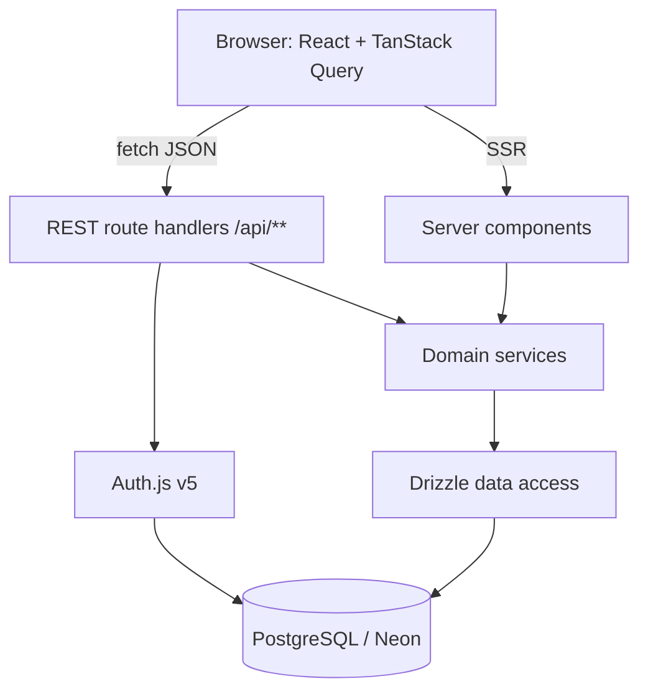
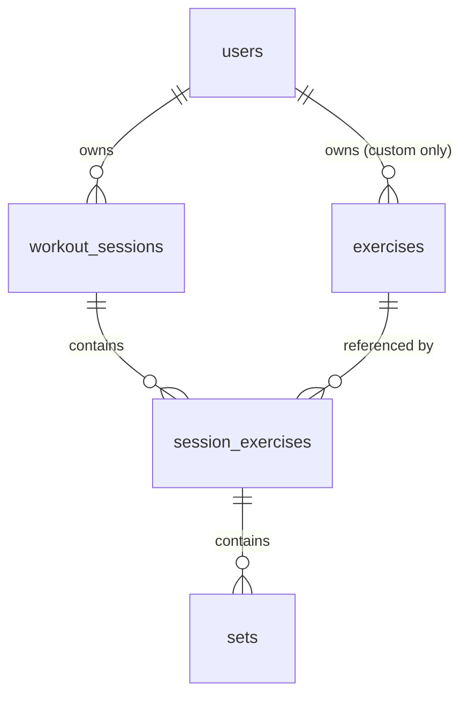

# Architecture

> Describes the system **as it is today**. Rewrite sections in place when things
> change — this file has no history. For *why* a choice was made, see
> `docs/decisions/`. For step-by-step request paths, see `docs/flows/`.

_Last reviewed: 2026-08-17_

> **Status: designed, not yet built.** No application code exists in this
> repository. Everything below is the agreed target shape, settled in ADRs
> 0002–0006. Sections marked _(planned)_ describe intent; update them to plain
> description as the code lands, and delete this banner once the first slice
> ships.

## One-paragraph summary

The Exercise App is a web-based workout logger. A signed-in user records a
training session as an ordered list of exercises, each with sets of reps and
weight, then reads that history back as progress over time. It is a single
Next.js application in TypeScript: React components in the browser talk to REST
route handlers in the same deployment, which delegate to domain services, which
reach PostgreSQL through Drizzle. The one thing a newcomer must understand is
that **every row of training data is owned by a user, and the owning user id is
always taken from the server-side session — never from the request**. That rule,
not the framework choices, is what the layering exists to protect.

## Components

| Component | Lives in | Responsibility | Talks to |
| --- | --- | --- | --- |
| Web UI | `app/**`, `components/**` | Render pages; capture set-by-set input fast enough to use between sets | REST API (via TanStack Query), domain services (server components only) |
| REST API | `app/api/**` | HTTP boundary: authenticate, validate with Zod, map results to status codes | Domain services |
| Domain services | `src/server/services/**` | Business rules: session lifecycle, ownership checks, personal records, volume aggregation | Data access |
| Data access | `src/server/db/**` | Drizzle schema, typed queries, migrations, unit conversion at the boundary | PostgreSQL |
| Auth | `src/server/auth.ts`, `app/api/auth/**` | Sign-in, sessions, the `users` table | PostgreSQL |

## System shape

## Boundaries and rules

These are the lines that are expensive to uncross:

- **The session is the only source of identity.** A handler or service takes the
  acting user id from the Auth.js session. Never from a body field, query
  parameter or path segment — see [ADR 0005](decisions/0005-authjs-with-owned-user-table.md).
- **Route handlers contain no SQL and no business rules.** They authenticate,
  validate, delegate, and translate the result into a status code. Four steps,
  in that order.
- **Domain services know nothing about HTTP.** No `Request`, no `Response`, no
  status codes. They throw typed domain errors; the handler maps them.
- **No Server Actions.** REST route handlers are the only mutation surface —
  see [ADR 0003](decisions/0003-rest-route-handlers-as-api.md).
- **Client components never import the database layer.** Anything under
  `src/server/**` is server-only and must stay unreachable from a `"use client"`
  file.
- **Every request body is parsed by a Zod schema at the handler edge.** Handlers
  work with the parsed output, never with raw JSON.
- **Weight is kilograms in the database, always.** Conversion to and from a
  user's display unit happens at the edges — never in a service, never in a
  query.
- **One UI kit.** shadcn/ui components are copied into `components/ui/` and
  edited in place. A second component library does not get added to solve a
  one-component problem.

## Data model

Ownership chain — everything hangs off `users`:

- **users** — Auth.js owns this table, plus `accounts`, `sessions` and
  `verification_tokens`. It lives in our database, so every foreign key is real.
- **exercises** — the movement catalog. `owner_id` is nullable: NULL is a seeded
  global exercise visible to everyone, a value is one user's private custom
  exercise. Every catalog read filters `owner_id IS NULL OR owner_id = <session user>`.
- **workout_sessions** — one training session for one user: start time, end
  time, notes.
- **session_exercises** — an exercise performed within a session, with
  `position` for ordering and its own notes. This row exists so ordering,
  per-exercise notes and supersets have somewhere to live.
- **sets** — the leaf: `position`, `reps`, `weight` (numeric, kilograms),
  `is_warmup`.

Reads that shape the schema: last performance of a given exercise, personal
record per exercise, and weekly volume by muscle group.

## External dependencies

| Service | Used for | Failure behaviour |
| --- | --- | --- |
| Neon (PostgreSQL) | All persistent data | Total outage: the app cannot function. Free-tier branches suspend when idle, so the first query after a pause is slow, not failed. |
| Vercel | Hosting, TLS, preview deploys | Outage takes the app down; no fallback host is configured. |
| Auth.js OAuth providers _(planned, optional)_ | Third-party sign-in | Provider outage blocks that sign-in method only; credentials sign-in stays available. |

## Environments

| | Local | Preview | Production |
| --- | --- | --- | --- |
| App | `next dev` | Vercel preview per branch | Vercel production |
| Database | Postgres in Docker, or a personal Neon branch | Neon branch per preview | Neon primary |

Configuration comes from environment variables (`.env.local` locally, project
settings on Vercel). Two database URLs are always set and never derived from
each other: a **pooled** URL for the running app, and a **direct** URL for
drizzle-kit migrations.

## Known rough edges

- **Nothing is built yet.** The repository contains documentation only. The
  first slice is auth plus the session→exercise→set write path.
- **Restore has never been tested.** Neon's automated backups are the whole
  recovery story and remain unverified. Test a restore before the log holds
  history worth losing.
- **`numeric` arrives as a string.** The Postgres driver returns `numeric`
  columns as strings. Weight must be converted once, in the data-access layer,
  or float arithmetic will drift into the UI unnoticed.
- **The nullable `owner_id` catalog filter is easy to forget.** A single query
  missing it leaks other users' custom exercises. It belongs in a shared query
  helper, not repeated by hand.
- **Serverless connection limits.** Vercel functions plus a non-pooled
  connection string is a failure that only appears under load.
- **shadcn components do not upgrade.** They are copies. Upstream fixes must be
  pulled in deliberately.
- **Auth.js v5 documentation lags its releases.** Expect config that looks right
  and is not.
