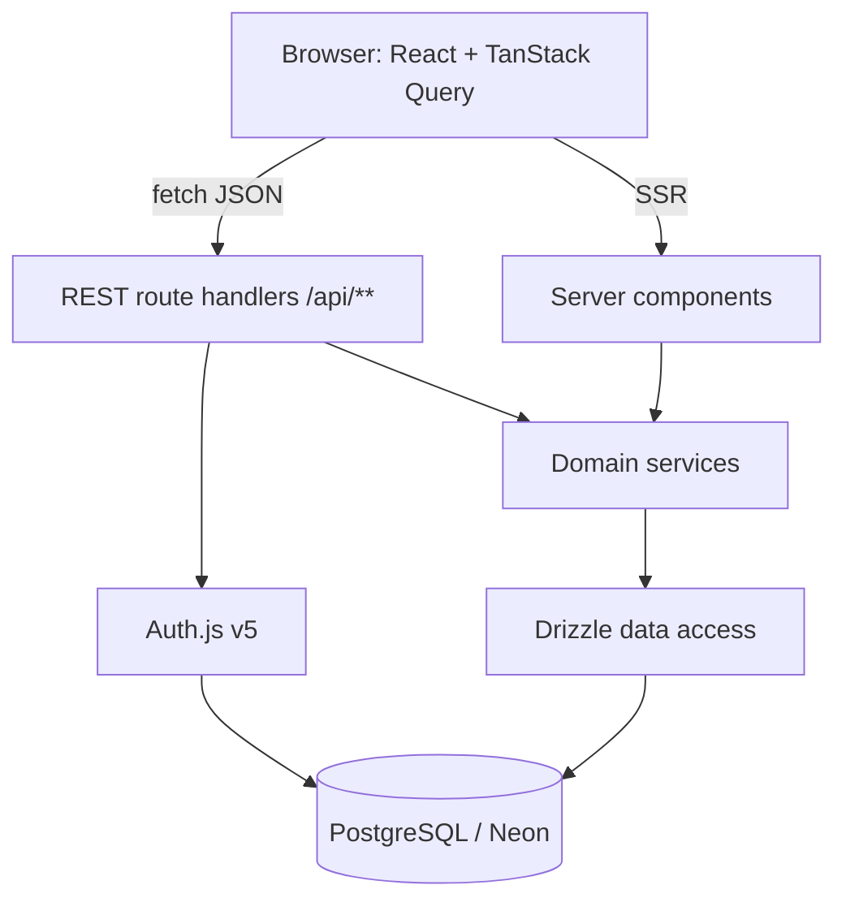
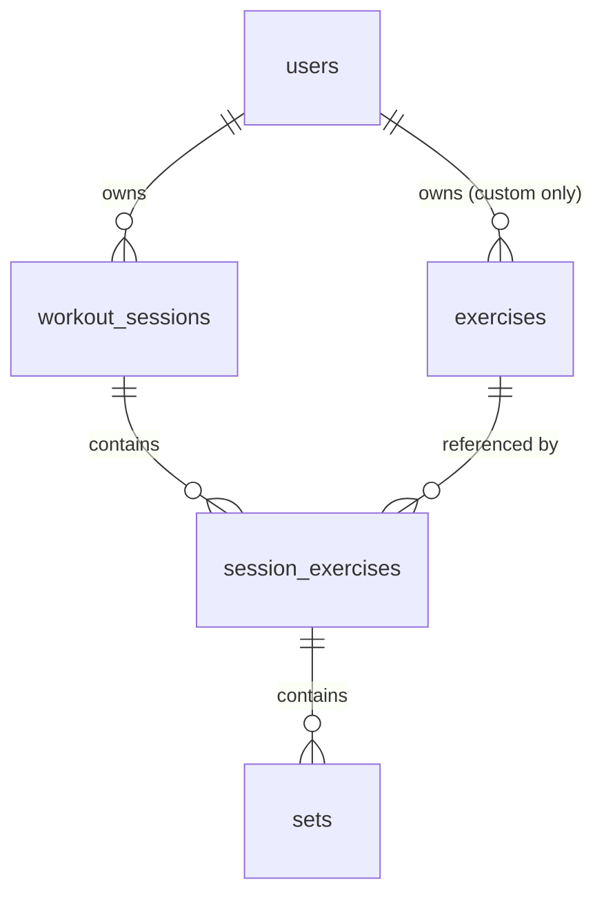

# Architecture

> Describes the system **as it is today**. Rewrite sections in place when things
> change — this file has no history. The decision records that explain *why*, and
> the per-path flow documents, are kept outside version control on the author's
> machine; this file is written to stand on its own without them.

_Last reviewed: 2026-08-17_

> Sections marked _(planned)_ are the agreed target shape and have no code
> behind them yet. Everything else describes what is in the repository.

## One-paragraph summary

The Exercise App is a web-based workout logger. A signed-in user records a
training session as an ordered list of exercises, each with sets of reps and
weight, then reads that history back as progress over time. It is a single
Next.js application in TypeScript: React components in the browser talk to REST
route handlers in the same deployment, which delegate to domain services, which
reach PostgreSQL through Drizzle. The one thing a newcomer must understand is
that **every row of training data is owned by a user, and the owning user id is
always taken from the server-side session — never from the request**. That rule,
not the framework choices, is what the layering exists to protect.

## What exists today

The authentication slice is built and running against the live database;
nothing of the training path is.

| Area | State |
| --- | --- |
| Schema | All eight tables migrated (`users`, `accounts`, `sessions`, `verification_tokens`, `exercises`, `workout_sessions`, `session_exercises`, `sets`). One migration, `0000_rapid_the_fury`. |
| Exercise catalog | Seeded, 60 global rows (`owner_id IS NULL`). `npm run db:seed` is idempotent. |
| Auth | Email/password sign-in, registration, sign-out. Auth.js v5, `jwt` session strategy. `currentUserId()` in `src/server/auth.ts` is how server code asks who is acting. |
| Route handlers | `POST /api/users` (register) and the Auth.js catch-all at `/api/auth/[...nextauth]`. Nothing else. |
| Pages | `/` (session-aware landing), `/sign-in`, `/sign-up`. |
| Domain services | `src/server/services/users.ts` only. |
| Error contract | `src/app/api/_lib/respond.ts` maps every `DomainErrorCode` to a status. |
| Tests | None. No runner is installed. |

The next slice is the workout session → exercise entry → set write path: its
services, its handlers and its UI.

## Components

| Component | Lives in | Responsibility | Talks to |
| --- | --- | --- | --- |
| Web UI | `src/app/**`, `src/components/**` | Render pages; capture set-by-set input fast enough to use between sets | REST API (`fetch` today, TanStack Query _(planned)_), domain services (server components only) |
| REST API | `src/app/api/**` | HTTP boundary: authenticate, validate with Zod, map results to status codes | Domain services |
| Domain services | `src/server/services/**` | Business rules: session lifecycle, ownership checks, personal records, volume aggregation | Data access |
| Data access | `src/server/db/**` | Drizzle schema, typed queries, migrations, unit conversion at the boundary | PostgreSQL |
| Auth | `src/server/auth.ts`, `src/app/api/auth/**` | Sign-in, auth sessions, the `users` table | PostgreSQL |

The App Router lives under `src/app/**`, not `app/**` — the app was scaffolded
with `--src-dir`.

## System shape

### Database access

`src/server/db/index.ts` is the only place a connection is opened. It uses
`pg` (node-postgres) through `drizzle-orm/node-postgres` against the **pooled**
Neon string — not `@neondatabase/serverless`, because the same handle has to
serve server components, route handlers and the drizzle-kit seed script. The
pool is capped at 10, handed to `attachDatabasePool` from `@vercel/functions`
so Fluid compute drains it before suspend, and cached on `globalThis` in
development so Next's module re-evaluation does not leak a pool per edit.

drizzle-kit is the exception: `drizzle.config.ts` reads `.env.local` itself and
connects with the **direct** URL, because migrations need a real session.

## Boundaries and rules

These are the lines that are expensive to uncross:

- **The session is the only source of identity.** A handler or service takes the
  acting user id from the Auth.js session. Never from a body field, query
  parameter or path segment.
- **Route handlers contain no SQL and no business rules.** They authenticate,
  validate, delegate, and translate the result into a status code. Four steps,
  in that order.
- **Domain services know nothing about HTTP.** No `Request`, no `Response`, no
  status codes. They throw typed domain errors; the handler maps them.
- **No Server Actions.** REST route handlers are the only mutation surface.
- **Client components never import the database layer.** Anything under
  `src/server/**` is server-only and must stay unreachable from a `"use client"`
  file.
- **Every request body is parsed by a Zod schema at the handler edge.** Handlers
  work with the parsed output, never with raw JSON.
- **Weight is kilograms in the database, always.** Conversion to and from a
  user's display unit happens at the edges — never in a service, never in a
  query.
- **One UI kit.** shadcn/ui components are copied into `src/components/ui/` and
  edited in place. A second component library does not get added to solve a
  one-component problem.

## Data model

Ownership chain — everything hangs off `users`:

- **users** — Auth.js owns this table, plus `accounts`, `sessions` and
  `verification_tokens`. It lives in our database, so every foreign key is real.
- **exercises** — the movement catalog. `owner_id` is nullable: NULL is a seeded
  global exercise visible to everyone, a value is one user's private custom
  exercise. Every catalog read filters `owner_id IS NULL OR owner_id = <session user>`.
- **workout_sessions** — one training session for one user: start time, end
  time, notes.
- **session_exercises** — an exercise performed within a session, with
  `position` for ordering and its own notes. This row exists so ordering,
  per-exercise notes and supersets have somewhere to live.
- **sets** — the leaf: `position`, `reps`, `weight` (numeric, kilograms),
  `is_warmup`.

Reads that shape the schema: last performance of a given exercise, personal
record per exercise, and weekly volume by muscle group.

## External dependencies

| Service | Used for | Failure behaviour |
| --- | --- | --- |
| Neon (PostgreSQL) | All persistent data | Total outage: the app cannot function. Free-tier branches suspend when idle, so the first query after a pause is slow, not failed. |
| Vercel | Hosting, TLS, preview deploys | Outage takes the app down; no fallback host is configured. |
| Auth.js OAuth providers _(planned, optional)_ | Third-party sign-in | Provider outage blocks that sign-in method only; credentials sign-in stays available. |

## Environments

| | Local | Preview | Production |
| --- | --- | --- | --- |
| App | `next dev` | Vercel preview per branch | Vercel production |
| Database | The same Neon database as everything else — there is no local Postgres and no Docker | Neon branch per preview _(planned)_ | Neon primary |

Configuration comes from environment variables (`.env.local` locally, project
settings on Vercel). Two database URLs are always set and never derived from
each other: a **pooled** URL for the running app, and a **direct** URL for
drizzle-kit migrations.

## Known rough edges

- **`next dev` writes files into the tree.** It regenerates `AGENTS.md` and the
  route types under `.next/types`. On a fresh clone `npx tsc --noEmit` fails
  with `Cannot find name 'LayoutProps'` until `npx next typegen` (or a dev
  server, or a build) has run once.
- **Development shares the production database.** With no local Postgres, a
  careless `npm run db:push` or a destructive query in Drizzle Studio hits real
  data. Per-developer Neon branches are the intended fix and are not set up.
- **Nothing is tested.** Vitest and Playwright are chosen but not installed, so
  the auth path — including the timing-equalised credential check in
  `verifyCredentials` — is verified by hand or not at all.
- **`src/app/layout.tsx` still carries the scaffold metadata.** Title and
  description read "Create Next App".
- **Auth.js `authorize` collapses every failure into `null`.** Deliberate, so
  accounts cannot be enumerated, but it also means a genuine database outage
  during sign-in is indistinguishable from a wrong password.
- **Restore has never been tested.** Neon's automated backups are the whole
  recovery story and remain unverified. Test a restore before the log holds
  history worth losing.
- **`numeric` arrives as a string.** The Postgres driver returns `numeric`
  columns as strings. Weight must be converted once, in the data-access layer,
  or float arithmetic will drift into the UI unnoticed.
- **The nullable `owner_id` catalog filter is easy to forget.** A single query
  missing it leaks other users' custom exercises. It belongs in a shared query
  helper, not repeated by hand.
- **Serverless connection limits.** Vercel functions plus a non-pooled
  connection string is a failure that only appears under load.
- **shadcn components do not upgrade.** They are copies. Upstream fixes must be
  pulled in deliberately.
- **Auth.js v5 documentation lags its releases.** Expect config that looks right
  and is not.
